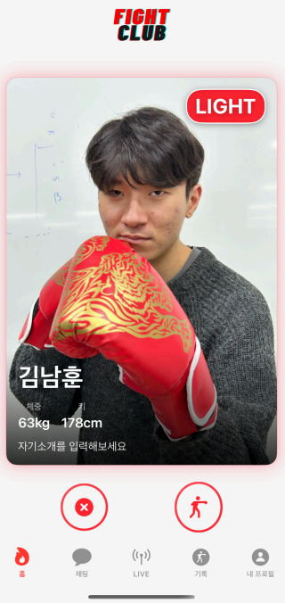
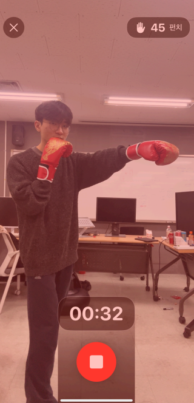
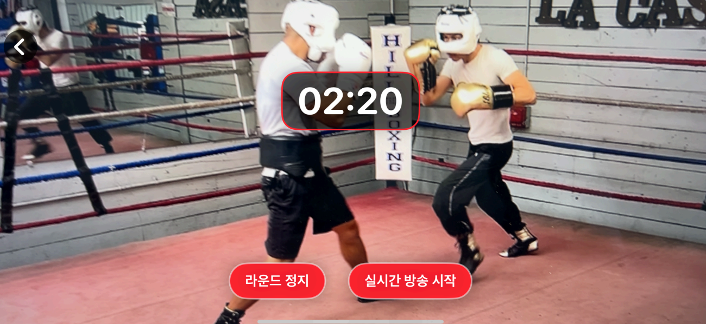
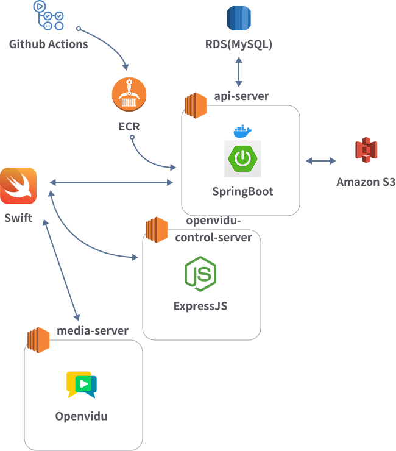

# FightClub

## 목차

1. [프로젝트 개요](#프로젝트-개요)
2. [주요 기능](#주요-기능)
3. [기술 스택](#기술-스택)
4. [아키텍처](#아키텍처)
5. [프로젝트 상세](#프로젝트-상세)

## 프로젝트 개요
FightClub은 **복싱 스파링 매칭 서비스**로, 사용자들이 체급에 맞는 스파링 파트너를 손쉽게 찾을 수 있도록 합니다. 틴더 스와이프 UI를 착안해 사용자가 쉽게 스파링 상대를 고를 수 있습니다. 또한 매칭된 스파링을 실시간 중계하여 다른 사용자들이 관전할 수도 있습니다.

| 항목       | 내용                                     |
|------------|----------------------------------------|
| 기간       | 24.12.15 ~ 25.01.14                                 |
| 인원       | 5명                                     |
| 역할       | 김남훈: 기획 및 백엔드  김현영·김정환: 백엔드  김지훈·이동인: iOS/Swift 개발 |

## 주요 기능
| 체급별 매칭 | 개인 트레이닝 | 실시간 중계 |
|------------|------------|------------|
|  |  |  |

## 기술 스택

| 분야            | 기술                                    |
| ------------- | ------------------------------------- |
| Backend       | Spring Boot (Java), Node.js (Express) |
| Frontend      | Swift (iOS)                           |
| Database      | MySQL, RDS                            |
| DevOps/Infra  | Docker, EC2, ECR, Github Actions      |
| Cloud/Storage | AWS S3                                |

## 아키텍처

## 프로젝트 상세
- [프로젝트 포스터 보기](https://drive.google.com/file/d/1TZNs0KaOdQxTN0lks0xlWNfqAlsra-LK/view?usp=drive_link)

- [API 서버](https://github.com/southernlight/fightclub/tree/main/api-server)

- [OpenVidu 서버](https://github.com/southernlight/fightclub/tree/main/openvidu-control-server)
