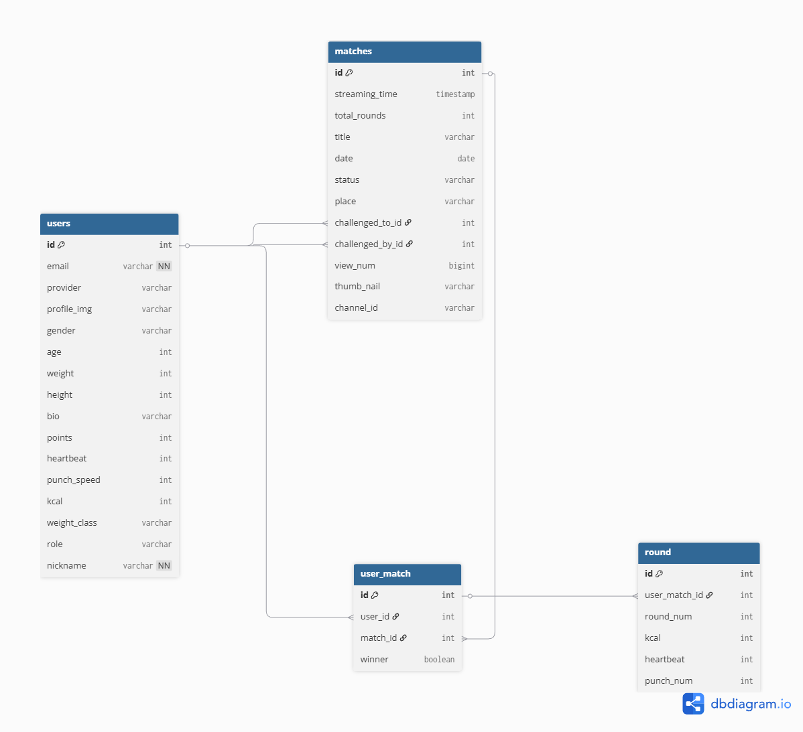
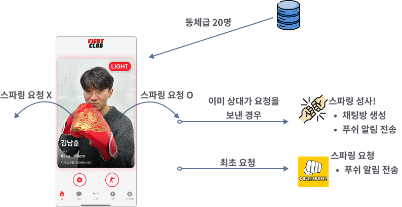

# FightClub(api-server)
FightClub 프로젝트의 **백엔드 API 서버**입니다. Spring Boot 기반으로 구현되었습니다. 이 서버는 클라이언트(iOS, Web)와 연동되며, 외부 서비스(AWS S3, Klat API)와 통합되어 있습니다.

## 기술 스택

| 분야            | 기술                                                                 |
| --------------- | -------------------------------------------------------------------- |
| Backend         | Java 17(Amazon Corretto), Spring Boot 3.x, Spring Web, Spring Security, JPA(Hibernate) |
| Database        | MySQL                                                             |
| DevOps/Infra    | Docker, Docker Compose                                               |
| Cloud/Storage   | AWS S3                                                               |
| External API    | Klat API(채팅)                                                       |
| Documentation   | Swagger (Springdoc OpenAPI 3)                                        |
| Build Tool      | Gradle                                                               |

## ERD


## 주요 워크플로우

- 스파링 요청/거절 플로우




## 실행 방법
1. 저장소 클론
```bash
git clone https://github.com/southernlight/fightclub.git
cd ./fightclub/api-server
```

2. 프로젝트 빌드
```bash
./gradlew clean build
```

3. `.env` 파일 생성(api-server 루트 디렉토리에 생성)

> ⚠️ 주의: 외부 의존성 필요
> <br> 이 프로젝트는 다음 외부 서비스와 연동됩니다.
> - AWS S3(파일 업로드)
> - Klat API(채팅)

<details>
<summary><strong>.env 예시 (클릭하여 펼치기)</strong></summary>

```env
# ------------------------------------
# Spring Datasource
# ------------------------------------
SPRING_DATASOURCE_DRIVER=com.mysql.cj.jdbc.Driver
SPRING_DATASOURCE_URL=jdbc:mysql://mysql:3306/데이터베이스명?useSSL=false&useUnicode=true&serverTimezone=Asia/Seoul&allowPublicKeyRetrieval=true
SPRING_DATASOURCE_USERNAME=DB_사용자이름
SPRING_DATASOURCE_PASSWORD=DB_비밀번호

# ------------------------------------
# MySQL Container Setup
# ------------------------------------
MYSQL_ROOT_PASSWORD=루트계정_비밀번호
MYSQL_DATABASE=데이터베이스명

# ------------------------------------
# JPA
# ------------------------------------
SPRING_JPA_HIBERNATE_DDL=update
SPRING_JPA_SHOW_SQL=false

# ------------------------------------
# JWT
# ------------------------------------
JWT_SECRET_ACCESS=JWT_ACCESS_비밀키_입력

# ------------------------------------
# AWS S3
# ------------------------------------
S3_REGION=aws_region_입력
S3_ACCESS_KEY=S3_액세스키_입력
S3_SECRET_KEY=S3_시크릿키_입력
S3_BUCKET=S3_버킷명

# ------------------------------------
# Klat
# ------------------------------------
KLAT_ID=Klat_ID_입력
KLAT_KEY=Klat_API_키_입력
KLAT_USER_PASSWORD=Klat_사용자_비밀번호_입력
 ```
</details>
4. Docker compose 로 컨테이너 실행

```bash
docker compose up --build -d
```
## API 명세(Swagger)

서버가 정상 실행되면 아래 주소에서 Swagger UI를 확인할 수 있습니다.

http://localhost:8081/swagger-ui/index.html#/
