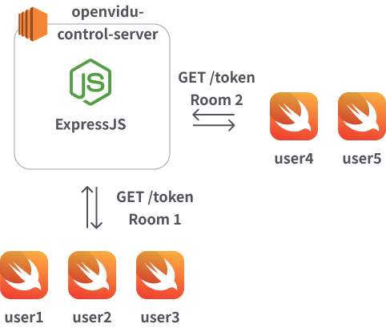
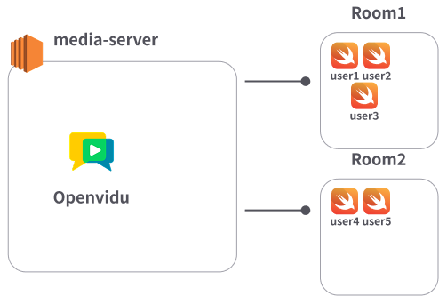

# FightClub(openvidu-control-server)

**Openvidu 미디어 서버의 룸 참여를 위한 토큰을 발급하는 서버**입니다. 또한, 이 서버는 룸 내 참가자들의 영상과 음성을 녹화할 수 있는 기능을 제공합니다.

자세한 사항은 [튜토리얼](https://livekit-tutorials.openvidu.io/tutorials/advanced-features/recording-basic/)을 확인하시길 바랍니다.

## 주요 워크플로우
- 클라이언트가 roomName과 participantName을 기반으로 openvidu-control-server에서 룸 참여용 JWT 토큰을 발급 받음



- 클라이언트가 발급받은 토큰으로 Openvidu 미디어 서버에 접속



## 실행 방법

-   Node.js 설치 필요 [Node.js 다운로드](https://nodejs.org/en/download)

1. 의존성 설치
```bash
$ npm ci 
## or 
$ npm install
```

2. `.env` 파일 생성(openvidu-control-server 루트 디렉토리에 생성)
> ⚠️ 주의: 외부 의존성 필요
> <br> 이 프로젝트는 다음 외부 서비스와 연동됩니다.
> - AWS S3(녹화 파일 저장)
> - LiveKit,Openvidu 서버 (실시간 영상 스트리밍)

<details>
<summary><strong>.env 예시 (클릭하여 펼치기)</strong></summary>

```env
# ------------------------------------
# 서버 포트
# ------------------------------------
SERVER_PORT=6080

# ------------------------------------
# LiveKit 설정
# ------------------------------------
LIVEKIT_URL=http://localhost:7880
LIVEKIT_API_KEY=devkey
LIVEKIT_API_SECRET=secret

# ------------------------------------
# S3 설정
# ------------------------------------
S3_ENDPOINT=your-s3-endpoint
S3_ACCESS_KEY=your-access-key
S3_SECRET_KEY=your-secret-key
AWS_REGION=your-aws-region
S3_BUCKET=your-bucket-name
RECORDINGS_PATH=recordings/
 ```
</details>

3. 서버 실행
```bash
$ npm run start # pm2 start
$ npm run stop # pm2 stop
$ npm run restart # pm2 restart
$ npm run delete # pm2 delete
```

## API 명세

| 기능           | Method | URL                      | Request                                                       | Response                                                                 | 설명                                    |
| -------------- | ------ | ------------------------ | ------------------------------------------------------------- | ------------------------------------------------------------------------ | ------------------------------------- |
| 토큰 발급      | POST   | /token                   | {<br>&nbsp;&nbsp;"roomName": "ROOM_NAME",<br>&nbsp;&nbsp;"participantName": "NAME"<br>} | {<br>&nbsp;&nbsp;"token": "JWT_TOKEN"<br>}                              | 룸 참여를 위한 JWT 토큰 발급            |
| 녹화 시작      | POST   | /recordings/start        | {<br>&nbsp;&nbsp;"roomName": "ROOM_NAME"<br>}                 | {<br>&nbsp;&nbsp;"message": "Recording started",<br>&nbsp;&nbsp;"recording": { "name": "FILE.mp4", "startedAt": 169xxx }<br>} | 해당 룸 녹화 시작, 이미 녹화 중이면 409 반환 |
| 녹화 중지      | POST   | /recordings/stop         | {<br>&nbsp;&nbsp;"roomName": "ROOM_NAME"<br>}                 | {<br>&nbsp;&nbsp;"message": "Recording stopped",<br>&nbsp;&nbsp;"recording": { "name": "FILE.mp4", "startedAt": 169xxx, "size": 10485760 }<br>} | 해당 룸 녹화 종료, 녹화 중이 아니면 409 반환 |
| 녹화 목록 조회 | GET    | /recordings  | ?roomName=ROOM_NAME&roomId=ROOM_ID | {<br>&nbsp;&nbsp;"recordings": [<br>&nbsp;&nbsp;&nbsp;&nbsp;{<br>&nbsp;&nbsp;&nbsp;&nbsp;&nbsp;&nbsp;"id": "EGRESS_ID",<br>&nbsp;&nbsp;&nbsp;&nbsp;&nbsp;&nbsp;"name": "FILE.mp4",<br>&nbsp;&nbsp;&nbsp;&nbsp;&nbsp;&nbsp;"roomName": "ROOM_NAME",<br>&nbsp;&nbsp;&nbsp;&nbsp;&nbsp;&nbsp;"roomId": "ROOM_ID",<br>&nbsp;&nbsp;&nbsp;&nbsp;&nbsp;&nbsp;"startedAt": 169xxx,<br>&nbsp;&nbsp;&nbsp;&nbsp;&nbsp;&nbsp;"size": 10485760<br>&nbsp;&nbsp;&nbsp;&nbsp;}<br>&nbsp;&nbsp;]<br>} | 녹화된 영상 목록 조회, roomName / roomId 필터 가능 |
| 녹화 스트리밍  | GET    | /recordings/:recordingName | Header: Range (선택)                                         | 스트리밍 mp4 데이터                                                     | 녹화 영상 스트리밍, Range 요청 지원     |
| 녹화 삭제      | DELETE | /recordings/:recordingName | -                                                             | {<br>&nbsp;&nbsp;"message": "Recording deleted"<br>}                     | 녹화 파일과 메타데이터 S3에서 삭제     |
